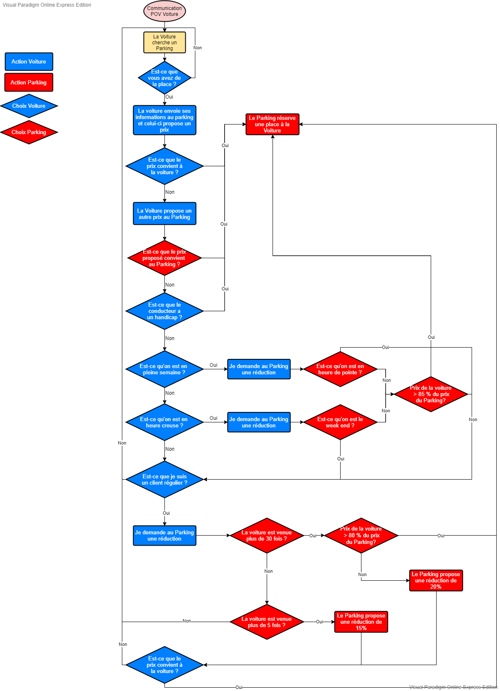
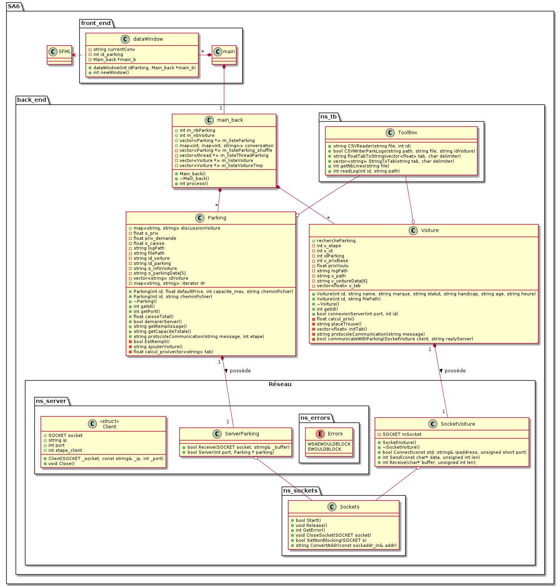

# SA6 - Intelligent Car-Park

## Description

This project was made in collaboration with **Kévin FROISSART, Valentin GACHOD, Anton GASQUET and Samir AKNINE** of the University Claude Bernard Lyon 1 (FRANCE).

## Usage

### Execute the program

```
$ git clone https://github.com/KevinFroissart/SA6_CarPark_AI.git
$ cd SA6_CarPark_Ai/SA6
$ make run
```

##### Requirements :

```
GCC : sudo apt install build-essential
or Clang : sudo apt install clang
SFML : sudo apt-get install libsfml-dev
```

### (re)Generate Documentation

```
$ cd SA6_CarPark_Ai/SA6
$ make doc
```

##### Requirements :

```
Graphviz : sudo apt install graphviz
Doxygen : sudo apt install doxygen
Java : sudo apt install default-jdk
```

## Project layout

    SA6/
    ├─ bin/             binaries
    ├─ CSV/             CSV files
    ├─ doc/             documentation
    │  ├─ html/         html version
    │  ├─ rtf/          RTF version
    |  ├─ flowchart     AI Flowchart
    │  └─ uml           uml
    ├─ headers/         hpp headers
    ├─ lib/             libs required
    ├─ obj/             object files
    └─ src/             source code

## License

The license used is **GNU GENERAL PUBLIC LICENSE v2**.

This program is free software; you can redistribute it and/or modify it under the terms of the GNU General Public License as published by the Free Software Foundation; either version 2 of the License, or (at your option) any later version.

This program is distributed in the hope that it will be useful, but WITHOUT ANY WARRANTY; without even the implied warranty of MERCHANTABILITY or FITNESS FOR A PARTICULAR PURPOSE.

See the LICENSE file for more details.

## Meta

Authors : https://github.com/KevinFroissart/SA6_CarPark_AI/graphs/contributors

### AI Flowchart



### UML


